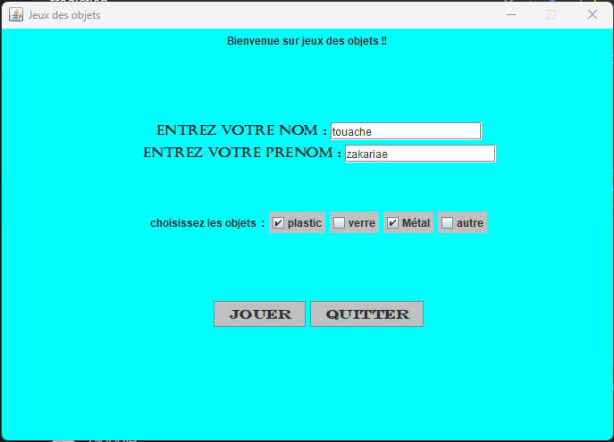

# Jeu des Objets

## Description
"Jeu des Objets" est un jeu basé sur Java avec une interface graphique où le joueur contrôle un objet (une palette) pour attraper des objets qui tombent du haut de l'écran. L'objectif du jeu est de marquer des points en attrapant ces objets tout en évitant certains objets dangereux. Le jeu comprend plusieurs niveaux avec une difficulté croissante à mesure que le joueur progresse. Avant de commencer, le joueur peut choisir les types d'objets avec lesquels il souhaite interagir.

 

## Comment jouer

### 1. Sélection des objets
   - Avant de commencer, vous devez entrer votre nom et choisir les types d'objets à attraper (Plastique, Verre, Métal, ou Autre).
   - Vous devez sélectionner au moins un type d'objet pour pouvoir démarrer le jeu.

### 2. Écran de jeu
   - Après avoir fait vos sélections, l'écran de jeu s'affiche.
   - Vous contrôlez la palette en déplaçant la souris horizontalement pour attraper les objets qui tombent du haut de l'écran.
   - Vous gagnez des points en attrapant les objets sélectionnés et en évitant ceux qui sont dangereux.
   - Si vous manquez trop d'objets ou attrapez des objets dangereux, votre "santé" (appelée `sang` dans le jeu) diminuera.

### 3. Niveaux et score
   - Le jeu comporte plusieurs niveaux, et la difficulté augmente à mesure que vous avancez.
   - Au fur et à mesure que vous marquez des points et passez au niveau suivant, la vitesse de chute des objets augmente, et la palette devient plus longue.

### 4. Fin du jeu
   - Le jeu se termine lorsque votre santé (`sang`) atteint zéro ou si vous attrapez un objet dangereux.
   - Vous pouvez quitter le jeu à tout moment en cliquant sur le bouton "Quitter" dans le menu principal.

## Contrôles
- **Souris** : Utilisez la souris pour déplacer la palette horizontalement.
